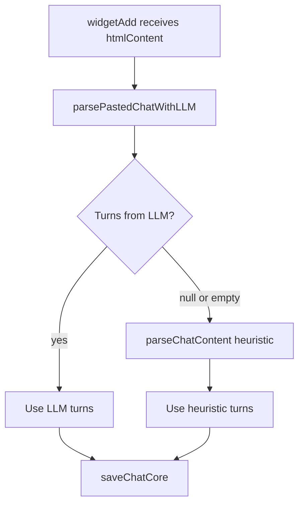

# Fix parsePastedChatWithLLM: make the API do what ChatGPT does

## Problem (recap)

- **widgetAdd** uses the LLM first for parsing; heuristic is only fallback when LLM returns null/empty.
- For a long multi-turn paste (e.g. 133k chars), the API (gpt-4.1-nano) returns **one turn**; when you paste the same blob into ChatGPT and ask it to parse and save, it does a great job (all turns).
- So the goal is **not** to demote the LLM to fallback, but to make the **API behave like that ChatGPT experience**: the LLM should extract every user/assistant exchange, not collapse to one.

## Why the API might underperform vs "paste into ChatGPT"

1. **Instructions**
   The current system prompt says: _"If there is only one block of text or no clear back-and-forth, output one turn with the other field as empty string."_ That explicitly allows a single turn and can be over-applied (e.g. treating long HTML as "one block" or "no clear back-and-forth"). In ChatGPT, the user says something like "parse this into turns," which doesn't suggest "one turn is fine."
2. **Input noise**
   We send raw HTML (tags, attributes, scripts). The model may focus on the first clear Q&A and ignore the rest, or treat the whole thing as one block. A cleaner text representation (strip tags, preserve structure) might help the model see all exchanges.
3. **Model**
   gpt-4.1-nano is fast and cheap but may prioritize brevity. A more capable model (e.g. gpt-4.1-mini) might follow "output every turn" more reliably. Worth trying if instruction changes aren't enough.

## Approach

Keep **LLM as the primary parser**. Improve the LLM path so it reliably outputs **all** turns:

1. **Tighten instructions** so the model is required to output every exchange and is not encouraged to output one turn for long/ambiguous input.
2. **Optionally preprocess** long or HTML-heavy input into cleaner text (strip tags, preserve blocks) so the model gets a clearer conversation structure.
3. **Optionally** try a stronger model for this task if nano still underperforms after (1) and (2).

No change to widgetAdd flow order: heuristic remains fallback when LLM returns null/empty.

## Implementation

### 1. Strengthen instructions in parsePastedChatWithLLM.ts

In [chat-vault-part2/src/utils/parsePastedChatWithLLM.ts](chat-vault-part2/src/utils/parsePastedChatWithLLM.ts), rewrite **PARSE_INSTRUCTIONS** so that:

- **Require all turns**: State explicitly that if the input contains multiple user/assistant exchanges (from any client: ChatGPT, Claude, Gemini, etc.), the model **must** output **every** exchange as a separate object in the `turns` array. Do not summarize or collapse multiple pairs into one.
- **Remove or narrow the "one turn" clause**: Either remove the sentence _"If there is only one block of text or no clear back-and-forth, output one turn with the other field as empty string"_ or restrict it to the true edge case: e.g. _"Only if the input genuinely contains a single message or no distinguishable user/assistant pairs, output a single turn (with the other field empty)."_
- **Keep** the rest: extract exact text verbatim, strip HTML but preserve message text, preserve markdown/line breaks, output only valid JSON matching the schema.

This makes the API's "contract" match the user's intent when they paste a chat and expect every turn to be saved.

### 2. (Optional) Preprocess HTML to text before sending to the LLM

If instruction changes alone don't fix long HTML pastes, add a **preprocessing** step in `parsePastedChatWithLLM` (or a helper used only when input is HTML and long, e.g. > 50k chars):

- Strip script/style tags (already done in widgetAdd's parseHtmlStructure; could reuse or share a small util).
- Replace block elements (e.g. `
`, `
`, `</article>`) with newlines; strip remaining tags; normalize runs of whitespace but keep paragraph/block boundaries.
- Send this **text** to the LLM instead of raw HTML so the model sees "User message… Assistant message… User message…" without markup noise.

Implement only if (1) is insufficient. Preprocessing should preserve enough structure (e.g. blank lines between messages) so the model can still identify turn boundaries.

### 3. (Optional) Use a stronger model for parsing

If gpt-4.1-nano still returns a single turn after (1) and (2), try a more capable model for this call only (e.g. **gpt-4.1-mini** or whatever the Responses API supports for `responses.parse`). Make the model configurable (env var or constant) so you can switch without code changes. This aligns with "ChatGPT does a great job" if the product uses a stronger model for the same task.

## Files to change

| File                                                                                                         | Change                                                                                                                                                                                                          |
| ------------------------------------------------------------------------------------------------------------ | --------------------------------------------------------------------------------------------------------------------------------------------------------------------------------------------------------------- |
| [chat-vault-part2/src/utils/parsePastedChatWithLLM.ts](chat-vault-part2/src/utils/parsePastedChatWithLLM.ts) | Rewrite PARSE_INSTRUCTIONS to require all turns and narrow/remove the "one turn when ambiguous" clause. Optionally: add HTML-to-text preprocessing for long/HTML input; make model configurable (env/constant). |

No changes to [widgetAdd.ts](chat-vault-part2/src/tools/widgetAdd.ts) for this plan; heuristic remains fallback when LLM returns null/empty.

## Flow (unchanged)

## Testing

- Paste the **same multi-turn blob** that today yields one turn. After (1): expect the API to return **all** turns. If not, try (2) and/or (3).
- Paste **single-turn** or ambiguous content: expect one turn (with the other field empty) only when there truly is no clear back-and-forth.
- Paste **plain text** (e.g. "User: … Assistant: …"): expect unchanged or improved behavior; no regression.
