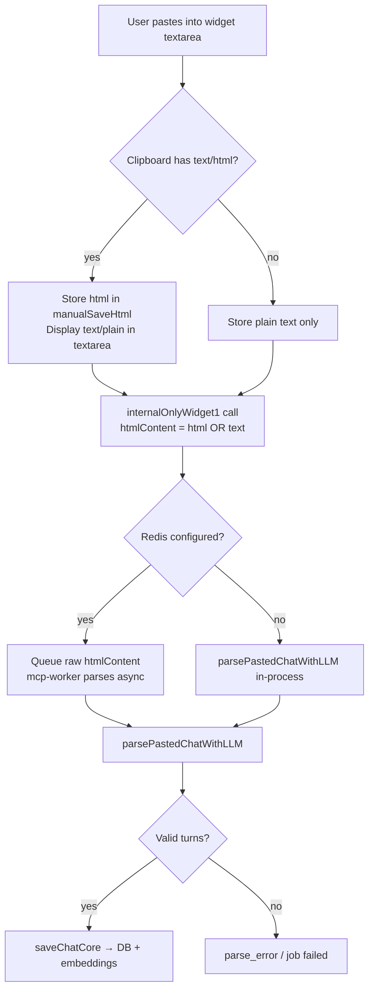
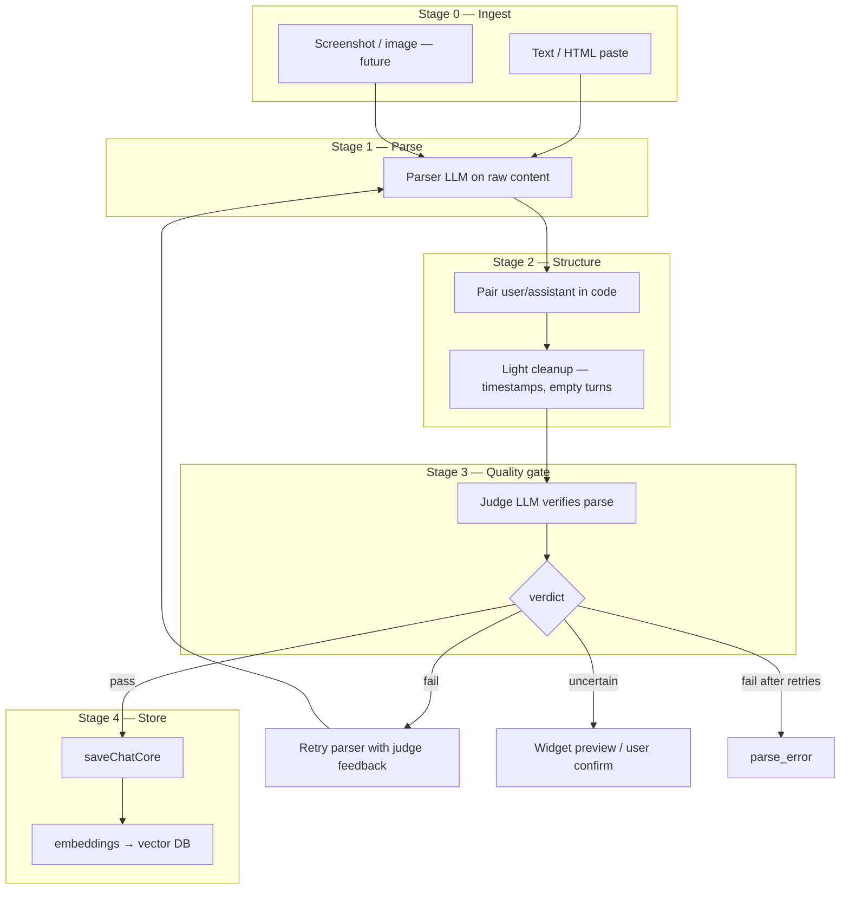

# Paste Turn Parsing Review

**Date:** 2026-06-27  
**Scope:** Manual save flow via `chat-vault-part-mcp-app` widget → `internalOnlyWidget1` (`widgetAdd`) → `parsePastedChatWithLLM` → `saveChatCore`  
**Trigger:** Poor turn quality when users copy/paste from web AI clients (example: Google Gemini conversation about ciabatta bread).

---

## Executive summary

ChatVault relies on a **single LLM parser** (`parsePastedChatWithLLM`) to turn pasted HTML or plain text into `{ prompt, response }[]` turns. There is **no heuristic fallback** in the current `widgetAdd` path—if the LLM fails or returns bad structure, the save fails or stores malformed turns.

Pasted content from **Google Gemini** (and similar web UIs) is especially hard because:

1. **Plain-text paste** collapses structure—timestamps, titles, citations, and message bodies run together.
2. **User markers** (`You said:`) and **grounding blocks** (`31 sites`, link previews) are interleaved with assistant replies.
3. The **first exchange** often has no explicit user line—the query title is fused with a timestamp (`baking ciabatta at home12:07 PM`).
4. The parser instructions assume ChatGPT/Claude-style HTML or recognizable user/assistant pairs, not Gemini’s export shape.

This document maps the current pipeline, analyzes the sample paste, records **actual observed output**, lists failure modes, and proposes improvements.

---

## Observed output (2026-06-27 test)

User pasted the full Gemini ciabatta conversation via the widget. Saved chat:

| Field | Value |
|-------|-------|
| **Title** | `Baking ciabatta at home (google)` |
| **Saved at** | Jun 27, 2026, 11:10 AM |
| **Turn count** | **1** (expected **3**) |

### Saved turn (only turn)

**Prompt:**

```
what about autolyse?
```

**Response** (abbreviated — full text was ~1,200 chars):

```
Using an autolyse stage is an excellent way to improve your ciabatta by making the wet dough easier to handle and boosting its final volume. Autolyse is a resting period where you mix only the flour and water before adding the yeast and salt.

During this rest, the flour fully hydrates, and natural enzymes break down starches and proteins. This jumpstarts gluten development mechanically, reducing the amount of mixing or folding you need to do later.

To integrate this step, modify the first part of the recipe like this:

The Initial Mix: Stir all 500g of bread flour and 400ml of water together in a bowl until no dry flour remains. Do not add the yeast, salt, or oil yet.
The Rest: Cover the bowl and let it sit at room temperature for 30 to 60 minutes.
The Final Mix: Sprinkle the yeast, salt, and olive oil over the top. Use your fingers to dimple and fold the ingredients into the hydrated dough until completely incorporated.
Proceed: Move directly into your first round of stretch-and-folds.

Why it helps high-hydration dough:
- Better Extensibility: ...
- Smoother Texture: ...
- Cleaner Flavor: ...

References:
- Reddit discussion on autolyse
- KitchenAid: What is Autolyse?
- Sourdough School Magazine on Autolyse

Would you like tips on how to adjust ambient temperature or water temperature for autolyse? Let me know!
```

### Expected vs actual

| Dimension | Expected | Actual | Verdict |
|-----------|----------|--------|---------|
| Turn count | 3 | 1 | **Fail** |
| Turn 1 prompt | `baking ciabatta at home` | *(missing)* | **Fail** |
| Turn 1 response | Full ciabatta recipe (~6 steps) | *(missing)* | **Fail** |
| Turn 2 prompt | `what about autolyse?` | `what about autolyse?` | **Pass** |
| Turn 2 response | Autolyse explanation | Present (see below) | **Partial** |
| Turn 3 prompt | `How to get the best crust in the normal oven?` | *(missing)* | **Fail** |
| Turn 3 response | Oven/steam/crust advice | *(missing)* | **Fail** |
| Verbatim fidelity | Exact copy from paste | Paraphrased, restructured | **Fail** |
| Citation handling | Strip `14 sites` / link previews | Converted to `References:` bullet list | **Fail** (wrong treatment) |

### What this failure pattern tells us

This is **not** a simple “collapse entire paste into one giant response” failure. The model:

1. **Selected one middle exchange** — the autolyse Q&A is the cleanest pair in the blob (explicit `You said:` marker, distinct topic boundary).
2. **Discarded ~67% of the conversation** — the initial recipe answer and the crust question/answer never made it into output.
3. **Violated verbatim instructions** — response is lightly paraphrased and re-sectioned (`Why it helps high-hydration dough:` bullets, `References:` block) despite instructions demanding exact copy.
4. **Re-synthesized citations** — grounding snippets (`14 sites`, Reddit/KitchenAid titles) became a curated References list instead of being stripped or kept verbatim.
5. **Kept the trailing follow-up question** — “Would you like tips on…” is Gemini’s conversational closing, stored as part of the assistant response.

The parser returned **technically valid** JSON (1 turn with non-empty prompt + response), so `widgetAdd` accepted it and saved — no error surfaced to the user beyond wrong content.

### Failure classification

```
Input:  [Turn1 recipe][citations][Turn2 autolyse][citations][Turn3 crust]
Output: [Turn2 autolyse only, paraphrased]
        ^^^^^^^^^^^^^^^^^^^^^^^^^^^^^^^^^^^^^^^^
        "Middle-turn cherry-pick" — worse than full collapse
```

---

## Current pipeline



### Widget capture (`chat-vault-part-mcp-app`)

On paste, the widget:

- Prefers **`text/html`** from the clipboard when present (stores in `manualSaveHtml`).
- Shows **`text/plain`** in the textarea for editing.
- Sends **`manualSaveHtml || manualSaveContent`** as `htmlContent` to the server.
- Clears stored HTML if the user manually edits the textarea (falls back to plain text only).

Relevant code: `chat-vault-part-mcp-app/src/chat-vault/index.tsx` — `onPaste` handler and `handleManualSave`.

### Server tool mapping

| Widget tool name       | Server implementation | Purpose                          |
|------------------------|-----------------------|----------------------------------|
| `internalOnlyWidget1`  | `widgetAdd`           | Parse pasted blob → save chat    |

### Parsing (`chat-vault-part2/src/utils/parsePastedChatWithLLM.ts`)

- Uses OpenAI **Responses API** with **structured output** (`ChatTurnsSchema`: `{ turns: [{ prompt, response }] }`).
- **Preprocesses** input via `preprocessPastedChat.ts` (boundary markers, turn-count hints, citation markers).
- **Default model**: `gpt-4.1-mini` (override via `PARSE_CHAT_LLM_MODEL`).
- **Retry model**: `gpt-4.1` when quality validation fails (override via `PARSE_CHAT_LLM_RETRY_MODEL`).
- **Quality gate**: rejects parses with too few turns vs `You said:` marker count, or <20% content retention.
- Returns `null` on missing API key, failed validation after both attempts, or API errors → **hard failure** in sync mode.

### Async worker (`monorepo/apps/mcp-worker`)

When Redis is configured, `widgetAdd` queues raw `htmlContent` without parsing. The worker uses the **same** parser and preprocessing as part2 (aligned 2026-06-27).

### What is still not in the pipeline

- No marker-based heuristic fallback when both LLM attempts fail (returns `parse_error` instead).
- No source-specific adapters (Gemini vs ChatGPT vs Claude) beyond generic marker rules.

### Preprocessing & validation (added 2026-06-27)

- `injectParseBoundaries` — `<<<USER>>>`, `<<<CITATIONS>>>` markers, timestamp splitting.
- `validateParseQuality` — turn count vs `You said:` markers, content retention check.
- `cleanupParsedTurn` — strip prefixes, synthesized References blocks.

---

## Sample input: Google Gemini ciabatta paste

Below is a structural breakdown of the user-reported paste (abbreviated for readability). The full blob is one continuous string when copied as plain text.

### Observed segments

| # | Segment type | Example fragment |
|---|--------------|------------------|
| 1 | Title + timestamp fused | `baking ciabatta at home12:07 PM` |
| 2 | Assistant body (long) | Recipe, ingredients, steps 1–6, equipment question |
| 3 | Grounding / citations | `31 sites`, Sally's Baking Addiction snippets, Instagram preview |
| 4 | User marker + question + time | `You said: what about autolyse?12:07 PM` |
| 5 | Assistant body | Autolyse explanation |
| 6 | Grounding / citations | `14 sites`, Reddit, KitchenAid links |
| 7 | User marker + question + time | `You said: How to get the best crust in the normal oven?12:08 PM` |
| 8 | Assistant body | Oven/steam/crust advice |

### Expected correct parse (3 turns)

| Turn | `prompt` | `response` (summary) |
|------|----------|----------------------|
| 1 | `baking ciabatta at home` (or empty if treated as sessionStorageType=assistant-only) | Full initial recipe answer **without** citation footer |
| 2 | `what about autolyse?` | Autolyse explanation **without** citation footer |
| 3 | `How to get the best crust in the normal oven?` | Crust/steam advice **without** trailing question to user |

### Failure modes with current parser

| Failure | Symptom in saved chat | Seen in ciabatta test? |
|---------|------------------------|------------------------|
| **Middle-turn cherry-pick** | 1 turn containing a single mid-conversation Q&A; other turns dropped | **Yes** |
| **Collapse to 1 turn** | Entire paste → one giant `response`, empty or wrong `prompt` | No |
| **Paraphrase despite verbatim rule** | Response reworded, re-sectioned, References synthesized | **Yes** |
| **Citations re-synthesized** | `14 sites` block → `References:` bullet list | **Yes** |
| **Citations included verbatim** | `31 sites`, link titles, snippets stored as raw paste text | No |
| **User marker left in prompt** | `You said: what about autolyse?12:07 PM` instead of clean question | No (marker stripped) |
| **Timestamp glued to text** | `home12:07 PM`, `autolyse?12:07 PM` in prompt/response boundaries | No |
| **First turn mis-attribution** | Title treated as assistant content or merged with response | Yes (turn 1 absent) |
| **Missing turns** | Only one of several Q&A pairs extracted | **Yes** (2 of 3 lost) |
| **LaTeX/math noise** | `\(3 \frac{1}{4}\text{ cups}\)` preserved verbatim (OK) or mangled (bad) | N/A (turn 1 lost) |

---

## Why Gemini / Google paste is harder than ChatGPT HTML

### 1. Plain text loses DOM boundaries

When the clipboard provides HTML, the widget sends it and the LLM can use tags (`<article>`, role attributes, class names) to find message blocks. Gemini’s plain-text export often has **no reliable delimiters**—only implicit patterns:

```
You said: <question><timestamp>
<assistant paragraph(s)>
<N> sites
<link previews>
```

The parser must infer boundaries from these weak signals.

### 2. Grounding blocks look like assistant content

Search grounding (`31 sites`, recipe site excerpts, “Show all”) is **not part of the conversational answer** but appears immediately after it with no clear separator. The LLM is instructed to copy verbatim, so it tends to **include citations inside `response`**.

### 3. Timestamps are inline, not on their own line

Patterns like `12:07 PM` are concatenated without whitespace separation from adjacent words. Regex or line-based heuristics miss them; the LLM may treat them as part of the message text.

### 4. First message asymmetry

Unlike ChatGPT threads that often start with an explicit user bubble, Gemini exports can begin with the **conversation title + first assistant reply**. The schema expects `prompt` + `response` pairs, so turn 1 is ambiguous:

- Option A: `prompt = "baking ciabatta at home"`, `response = <recipe>`
- Option B: `prompt = ""`, `response = <title + recipe>` (violates UX expectations)
- Option C: Model merges everything into one turn (common failure)

### 5. Model and instruction mismatch

Instructions emphasize HTML structure (`<article>`, markdown conversion) and “scan entire input for every pair.” Gemini plain text may not match the patterns the model was implicitly tuned on. **`gpt-4.1-nano`** (part2 sync default) is more prone to collapsing long ambiguous blobs into a single turn than **`gpt-4.1-mini`** (worker default).

---

## Quality dimensions to measure

When reviewing parser output for a paste, score each dimension:

| Dimension | Good | Bad |
|-----------|------|-----|
| **Turn count** | Matches visible user questions (3 for sample) | 1 turn, or >3 spurious splits |
| **Prompt cleanliness** | Question text only | `You said:`, timestamps, site names in prompt |
| **Response completeness** | Full assistant answer per turn | Truncated, summarized, or merged across turns |
| **Citation handling** | Grounding/links stripped or in separate metadata | `31 sites` block inside response |
| **Formatting** | Headings, lists, bold preserved as markdown | Flat wall of text; lost structure |
| **Verbatim fidelity** | Recipe numbers/steps unchanged | Paraphrased or meta-commentary (“The user asked…”) |

---

## Target architecture (agreed direction)

Goal: paste **any chat from any source** (HTML, plain text, future screenshots) → separate turns → store in vector DB. Quality is the priority; cost is secondary.

Design principle: **parser LLM on raw content + judge LLM for verification**. Drop source-specific regex as a correctness dependency. Keep only trivial deterministic steps (strip script/style, schema validation, light post-cleanup).



### Stage 0 — Ingest

| Modality | Today | Future |
|----------|-------|--------|
| HTML / plain text | Widget clipboard paste → `htmlContent` | Same |
| Screenshot | — | Image paste/upload → vision-capable parser |
| Structured save | LLM save tools (`saveChat`) | Skip parse |

Minimal preprocessing only: strip `<script>` / `<style>`. **Do not** mutate content with source-specific markers before the parser sees it.

### Stage 1 — Parse (Parser LLM)

**Input:** raw paste as the user copied it.  
**Output:** structured turns or ordered messages.

```json
{
  "turns": [
    { "prompt": "...", "response": "..." }
  ]
}
```

Alternative (often more reliable): emit `messages: [{ role, text }]` and pair in Stage 2.

**Parser responsibilities:**
- Split the full paste into every user/assistant exchange
- Copy text verbatim (no paraphrase, no synthesized References)
- Omit UI chrome (citations, nav, “31 sites”, link previews)
- Preserve markdown structure from HTML where present

**Parser model:** strong instruction-following model (e.g. `gpt-5.5` or `gpt-4.1`). Optimize for faithful extraction, not summarization. For screenshots later: same model with vision input.

**Retry:** only after Stage 3 failure, with judge feedback injected into parser prompt.

### Stage 2 — Structure (mostly code)

Deterministic steps — no LLM:
- Pair consecutive `user` → `assistant` messages into `{ prompt, response }`
- Handle opening assistant-only block (title/query as prompt)
- Strip `You said:`, trailing timestamps
- Drop empty turns
- Validate Zod schema

### Stage 3 — Quality gate (Judge LLM)

**This is how we know the parse failed and whether to retry.** The judge compares **raw input + parser output** — source-agnostic, no `You said:` counting.

**Input to judge:**
1. Original raw content (full paste)
2. Parser output (`turns[]`)

**Output schema:**

```json
{
  "verdict": "pass" | "fail" | "uncertain",
  "issues": ["missing_turns", "paraphrased", "citations_included", "wrong_roles", "incomplete_coverage"],
  "turns_in_source": 3,
  "turns_in_output": 1,
  "coverage": "high" | "medium" | "low",
  "explanation": "Output contains only the autolyse exchange; opening recipe and crust Q&A are missing from the source."
}
```

**Judge questions (explicit in prompt):**
1. Does the output include **all** conversational Q&A from the input?
2. Is the text **verbatim** (not summarized or re-sectioned)?
3. Is content in the correct role (`prompt` = user, `response` = assistant)?
4. Are citation/grounding/UI blocks incorrectly included?
5. How many distinct exchanges appear in the source vs the output?

**Judge model:** use a **different** model from the parser (different blind spots). Example: parser = `gpt-5.5`, judge = `gpt-4.1`; or the reverse.

**Actions by verdict:**

| Verdict | Action |
|---------|--------|
| `pass` | Proceed to Stage 4 (save + embed) |
| `fail` | Retry parser with judge `explanation` + `issues`; escalate model or strategy if repeated |
| `uncertain` | Retry if attempts remain; **reject on final attempt** (preview UX planned) |
| Judge unavailable | Retry judge once (`PARSE_JUDGE_RETRIES`), then retry parse; **reject on final attempt — never save unverified** |
| All retries exhausted | `parse_error` — never silent bad save |

Optional cheap pre-checks before calling judge (empty turns, obvious truncation) — but **the judge is the real gate**, not regex heuristics.

**Why this catches the ciabatta bug:** judge sees 3 exchanges in source, 1 in output → `verdict: fail`, `issues: ["missing_turns"]` → retry with feedback. No Gemini markers required.

### Stage 4 — Store

Unchanged: `saveChatCore` → `turns` JSONB + `text-embedding-3-small` via `combineChatText` / `splitTurnsForEmbedding`.

### Retry ladder (quality-first)

```
1. Parser (model A)  →  turns
2. Judge (model B)   →  pass? → save
                     →  fail? → retry parser with judge feedback
3. Parser retry      →  (same or stronger model + "fix: …")
4. Judge again
5. Still fail        →  widget preview OR parse_error
```

Never retry with a **weaker** model. Escalate decomposition (e.g. messages[] pass) or human review.

### Planned modules

| Module | Role |
|--------|------|
| `parsePastedChatWithLLM.ts` | Stage 1 — parser only, raw in → turns out |
| `verifyParsedChatWithLLM.ts` | Stage 3 — judge, raw + turns → verdict |
| `pairMessagesToTurns.ts` | Stage 2 — deterministic pairing (if using messages schema) |
| `widgetAdd.ts` | Orchestrate parse → verify → retry → save |

Env vars (proposed):

```bash
PARSE_CHAT_LLM_MODEL=gpt-5.5          # parser
VERIFY_CHAT_LLM_MODEL=gpt-4.1         # judge (different model)
PARSE_CHAT_LLM_RETRY_MODEL=gpt-5.5    # parser retry (same or stronger, never weaker)
```

---

## Recommendations (prioritized — updated)

### P1 — Implement dual-LLM pipeline (parser + judge)

Replace marker-based `validateParseQuality` as the primary gate with `verifyParsedChatWithLLM`:
- Parser reads **raw** content (drop `injectParseBoundaries` / parsing hints from input)
- Judge receives raw + turns, returns structured verdict
- Retry parser on `fail` with judge feedback

### P2 — Parser on raw content only

Remove source-specific preprocessing from the parser input path. Keep `stripScriptAndStyle` and post-parse cleanup only.

### P3 — Quality models

- Parser: `gpt-5.5` (or `gpt-4.1`) — faithful extraction
- Judge: different model — comparison and omission detection
- Never downgrade on retry

### P4 — Widget preview for `uncertain`

When judge returns `uncertain`, show turn preview before commit. Essential for screenshots and edge cases.

### P5 — Fixture tests

Golden files for Gemini, ChatGPT HTML, Claude. Unit tests for judge verdict schema. Integration tests (env-gated) for full parse → verify → save.

### P6 — Screenshot ingest (future)

Extend widget + parser for image input; same pipeline after Stage 0 with vision-capable parser and vision judge.

### ~~Superseded~~ (cost-era approach)

- ~~P2 Gemini-specific instruction hacks as primary fix~~
- ~~P3 regex boundary injection (`<<<USER>>>`)~~
- ~~P5 marker-based heuristic fallback~~

These remain optional diagnostics only, not correctness gates.

---

## Recommendations (historical — pre dual-LLM decision)

### H1 — Align parser defaults across deployments

Extend `PARSE_INSTRUCTIONS` with explicit rules:

- Split on `You said:` (case-insensitive) as user message start.
- Strip trailing timestamp patterns like `\d{1,2}:\d{2}\s*[AP]M` from prompt and response boundaries.
- **Exclude** grounding blocks: lines matching `\d+\s+sites`, link-preview paragraphs after “Show all”, and standalone URL/title snippets that are not part of the assistant’s prose.
- For opening segment with title + assistant reply and no prior user line: use the title (before timestamp) as `prompt`.

### P3 — Preprocess before LLM (deterministic)

Add a lightweight normalizer for plain-text pastes (when input does not look like HTML):

1. Insert newlines before `You said:`.
2. Split fused title/timestamp: `(.+?)(\d{1,2}:\d{2}\s*[AP]M)` → `$1\n$2\n`.
3. Mark citation blocks with a sentinel or remove lines matching `^\d+ sites$` through `Show all`.
4. Pass normalized text to the LLM (still use LLM for final turn assembly).

This reduces reliance on the model noticing weak boundaries.

### P4 — Post-parse validation and cleanup (critical — would have caught this bug)

After LLM output:

- Strip `You said:` prefix from prompts.
- Trim timestamp suffixes from prompts/responses.
- Optionally detect citation blocks at end of responses (heuristic: `\n\d+ sites\n`).
- **Reject or retry when turn count is suspiciously low** — e.g. input contains 2+ `You said:` markers but output has fewer turns. The ciabatta paste has **2** explicit user markers → expect **≥2 turns** (or 3 if title counts as turn 1). Getting **1 turn** should trigger retry with stronger model or heuristic fallback.
- **Reject paraphrased output** — optional check: if input contains distinctive phrases (e.g. `"Stretch and Folds"`, `"31 sites"`) and output omits them, flag as incomplete.

### P5 — Heuristic fallback (restore planned behavior)

When LLM returns `null` or suspiciously low turn count, fall back to marker-based splitting:

```
/^You said:\s*/i  → user boundary
/^\d+ sites$/m    → citation block start (truncate response)
```

Return `parse_error` only if both paths fail.

### P6 — Fixture tests

Add golden-file tests under `chat-vault-part2/tests/`:

- `fixtures/paste-gemini-ciabatta.txt` — the reported sample (full text).
- `fixtures/paste-chatgpt-html.html` — multi-turn ChatGPT HTML export.
- `fixtures/paste-claude.txt` — Claude plain export.

Assert turn count, prompt strings, and that citation markers are absent from responses.

### P7 — Widget UX (optional)

- Show a **preview of detected turns** before save (requires parse-before-commit or client-side dry run).
- Detect paste source when possible (clipboard HTML classes) and label: “Detected: Gemini — turn split may need review.”

---

## Debugging checklist

When investigating a bad save:

1. **Widget logs** (Ctrl+Alt+D): Was `hasHtml: true`? What was `htmlContentLength`?
2. **Server logs** `[parsePastedChatWithLLM]`: Input length, model, `output_parsed.turns length`.
3. **Sync vs async**: Redis configured → worker uses mini; local dev without Redis → part2 may use nano.
4. **Compare** raw `htmlContent` to saved `turns` JSON in DB.
5. **Re-run** parser locally:

   ```bash
   cd chat-vault-part2
   # Set OPENAI_API_KEY, optionally PARSE_CHAT_LLM_MODEL=gpt-4.1-mini
   # Call parsePastedChatWithLLM with fixture file contents
   ```

---

## Open questions

1. Should **grounding/citations** be stored separately (new field) or dropped entirely?
2. Is turn 1 with **title-only prompt** (no explicit user message) acceptable product-wise?
3. Should the widget **always prefer HTML** even when plain text looks cleaner (Gemini sometimes provides poor HTML)?
4. Do we need **source detection** (`gemini` | `chatgpt` | `claude` | `unknown`) in the job payload for adapter selection?

---

## Related files

| File | Role |
|------|------|
| `chat-vault-part-mcp-app/src/chat-vault/index.tsx` | Paste capture, `internalOnlyWidget1` call |
| `chat-vault-part2/src/tools/widgetAdd.ts` | Queue or sync parse + save |
| `chat-vault-part2/src/utils/preprocessPastedChat.ts` | Interim preprocess + marker validation (to be demoted) |
| `chat-vault-part2/src/utils/parsePastedChatWithLLM.ts` | Stage 1 parser (sync path) |
| `chat-vault-part2/src/utils/verifyParsedChatWithLLM.ts` | Stage 3 judge |
| `chat-vault-part2/src/utils/parseAndVerifyPastedChat.ts` | Pipeline orchestrator |
| `chat-vault-part2/src/utils/chatTurnTypes.ts` | Shared types |
| `chat-vault-part2/src/utils/saveChatCore.ts` | Stage 4 — persist turns + embeddings |
| `monorepo/apps/mcp-worker/src/chat-save-job.ts` | Async parse + save |
| `monorepo/apps/mcp-worker/src/chatvault/preprocessPastedChat.ts` | Same preprocess (async worker) |
| `monorepo/apps/mcp-worker/src/chatvault/parsePastedChatWithLLM.ts` | Same LLM parser (async worker) |
| `.cursor/plans/fix-parsepastedchat-llm-api.plan.md` | Prior plan (partially implemented) |

---

## Next steps

1. ~~Capture actual parser output~~ — **done** (see [Observed output](#observed-output-2026-06-27-test)).
2. ~~Cost-era preprocess + marker validation~~ — **done** (interim); superseded by [Target architecture](#target-architecture-agreed-direction).
3. ~~**Implement Stage 3:** `verifyParsedChatWithLLM.ts`~~ — **done**.
4. ~~**Refactor Stage 1:** parser on raw content only~~ — **done** (`prepareRawPasteForLLM`).
5. ~~**Wire `widgetAdd`:** parse → verify → retry~~ — **done** (`parseAndVerifyPastedChat.ts`); mcp-worker synced.
6. **Re-test** ciabatta paste via widget — judge should fail 1-turn output and trigger retry.
7. Add env-gated integration test for live parse → verify pipeline.
